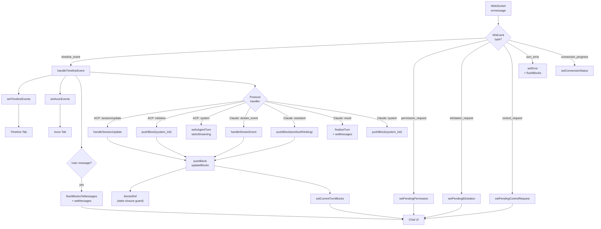

# Combined-App Architecture

## Overview

The combined-app is a full-stack demo (Express + React) that supports both ACP
and Claude Code agents through a unified chat UI. It consumes the
`@runloop/remote-agents-sdk` SDK's timeline event API to render a streaming
chat experience with tool calls, thinking blocks, plans, and more.

## System Diagram

```
┌──────────────────────────────────────────────────────────────────────┐
│  Runloop Infrastructure                                              │
│                                                                      │
│  ┌─────────┐    SSE     ┌──────────┐    broker    ┌──────────────┐  │
│  │  Axon   │◄──────────►│  Devbox  │◄────────────►│ Agent Binary │  │
│  │ Channel │            │          │   (ACP/Claude)│ (opencode,   │  │
│  └────┬────┘            └──────────┘              │  claude, etc)│  │
│       │                                            └──────────────┘  │
└───────┼──────────────────────────────────────────────────────────────┘
        │ SSE stream (AxonEventView)
        ▼
┌──────────────────────────────────────────────────────────────────────┐
│  Express Server (src/server/)                                        │
│                                                                      │
│  ┌──────────────────┐     ┌───────────────────────┐                  │
│  │ ACPConnectionMgr │     │ ClaudeConnectionMgr   │                  │
│  │                  │     │                       │                  │
│  │  ACPAxonConn     │     │  ClaudeAxonConn       │                  │
│  │  NodeACPClient   │     │  onControlRequest()   │                  │
│  └────────┬─────────┘     └───────────┬───────────┘                  │
│           │                           │                              │
│           │  onTimelineEvent ──► WsBroadcaster.broadcast()           │
│           │  client.onEvent  ──► WsBroadcaster.broadcast()           │
│           │                           │                              │
│  ┌────────┴───────────────────────────┴───────────┐                  │
│  │              WsBroadcaster (ws.ts)              │                  │
│  │  Broadcasts WsEvent to all connected clients   │                  │
│  └────────────────────┬───────────────────────────┘                  │
│                       │                                              │
│  REST API: /api/start, /api/prompt, /api/cancel,                     │
│            /api/subscribe, /api/shutdown, ...                         │
└───────────────────────┼──────────────────────────────────────────────┘
                        │ WebSocket
                        ▼
┌──────────────────────────────────────────────────────────────────────┐
│  React Client (src/client/)                                          │
│                                                                      │
│  App.tsx ─► useAgent() ─► useACPAgent() / useClaudeAgent()           │
│                                                                      │
│  ┌─────────────────────────────────────────────────────────────────┐ │
│  │                        Chat Area                                │ │
│  │  messages[] ──► AssistantTurn / User message rows               │ │
│  │  currentTurnBlocks[] ──► Live AssistantTurn                     │ │
│  │  pendingPermission ──► PermissionDialog (above input)           │ │
│  │  pendingElicitation ──► ElicitationForm (above input)           │ │
│  │  pendingControlRequest ──► ControlRequestPrompt (above input)   │ │
│  └─────────────────────────────────────────────────────────────────┘ │
│  ┌─────────────────────────────────────────────────────────────────┐ │
│  │                     Events Sidebar                              │ │
│  │  Tab: Activity ──► TurnBlocksInspector (block-level view)       │ │
│  │  Tab: Timeline ──► TimelineEventItem[] (classified events)      │ │
│  │  Tab: Axon     ──► AxonEventItem[] (raw AxonEventView)          │ │
│  └─────────────────────────────────────────────────────────────────┘ │
└──────────────────────────────────────────────────────────────────────┘
```

## WsEvent Types

The server broadcasts these event types over WebSocket:

| WsEvent type           | Source                          | Client handler                |
|------------------------|---------------------------------|-------------------------------|
| `timeline_event`       | `conn.onTimelineEvent()`        | `handleTimelineEvent()`       |
| `connection_progress`  | Manager (during provisioning)   | `setConnectionStatus()`       |
| `turn_error`           | Manager (on turn failure)       | `setError()` + flush blocks   |
| `permission_request`   | `NodeACPClient.requestPermission()` | `setPendingPermission()`  |
| `permission_dismissed` | `NodeACPClient.extNotification()` | Clear pending permission    |
| `elicitation_request`  | `NodeACPClient.extMethod()`     | `setPendingElicitation()`     |
| `elicitation_dismissed`| `NodeACPClient.extNotification()` | Clear pending elicitation   |
| `control_request`      | `ClaudeConnectionMgr.onControlRequest()` | `setPendingControlRequest()` |

## Client Data Flow



## State Architecture

### Hook Hierarchy

```
App.tsx
 ├── useAgentList()          Agent sidebar list (GET /api/agents)
 ├── useAttachments()        Composer file/image attachments
 └── useAgent(id, type)      Unified agent facade
      ├── useClaudeAgent(id)   Claude-specific state + WebSocket
      └── useACPAgent(id)      ACP-specific state + WebSocket
```

`useAgent` always mounts both protocol hooks but only passes a non-null
`agentId` to the active one. It returns a discriminated union
`UseAgentReturn = ClaudeAgentState | ACPAgentState | IdleAgentState`,
where each variant extends `SharedAgentState` (connection, chat, events,
common actions) with protocol-specific fields and actions. Components
narrow via `agent.agentType === "acp"` / `agent.agentType === "claude"`
checks to access protocol-specific state.

### State Management

Each protocol hook uses `useReducer` with a single state object and typed
action union (e.g. `ACPState` / `ACPAction`, `ClaudeState` / `ClaudeAction`).
This replaces the previous 35+ individual `useState` calls and makes
`resetAllState` a single `dispatch({ type: "RESET" })`. Both hooks share a
`useBlockManager()` hook for turn block accumulation (see below).

### State Categories

Each protocol hook manages these state categories:

| Category       | Examples                                              | Scope   |
|----------------|-------------------------------------------------------|---------|
| Connection     | `connectionPhase`, `connectionStatus`, `error`        | Shared  |
| Chat           | `messages`, `currentTurnBlocks`, `isAgentTurn`        | Shared  |
| Events         | `axonEvents`, `timelineEvents`                        | Shared  |
| Permissions    | `pendingPermission`, `pendingElicitation`, `autoApprove` | Per-protocol |
| Session config | `modes`, `configOptions`, `models` (ACP only)         | ACP     |
| Agent info     | `agentInfo`, `connectionDetails`, `authMethods`       | ACP     |
| Init info      | `initInfo`, `permissionMode`, `currentModel`          | Claude  |

### Block Management (`useBlockManager` hook)

Both hooks consume a shared `useBlockManager()` hook that encapsulates the
turn block accumulation pattern:

- `blocksRef` (React ref) -- mutable array for synchronous reads in event handlers
- `currentTurnBlocks` (React state) -- triggers re-renders
- `pushBlock()` / `updateBlocks()` -- write to both ref and state
- `finalizeThinking()` -- close active thinking block with duration
- `flushToMessage()` -- move accumulated blocks into a `ChatMessage`
- `reset()` -- clear all block state

ACP flushes lazily (on next user message) because the broker can deliver
`session/update` events after `turn.completed`. Claude flushes eagerly on
`result`.

## Timeline Event Model

The SDK classifies every raw `AxonEventView` into a typed timeline event:

```
TimelineEvent
 ├── { kind: "acp_protocol", eventType: string, data: ..., axonEvent }
 ├── { kind: "claude_protocol", data: SDKMessage, axonEvent }
 ├── { kind: "system", data: SystemEvent, axonEvent }
 └── { kind: "unknown", data: null, axonEvent }
```

The three sidebar tabs show different views of the same event stream:

| Tab      | Data source      | Shows                                        |
|----------|------------------|----------------------------------------------|
| Activity | `messages` + `currentTurnBlocks` | Block-level view (thinking, tool calls, text) |
| Timeline | `timelineEvents` | Classified events with kind/origin badges     |
| Axon     | `axonEvents`     | Raw `AxonEventView` with payload tree         |

## Permission / Elicitation Flow

Permissions and elicitations are interactive request/response flows that
block the agent until the user responds. They are handled out-of-band from
the timeline event stream.

```
Server (NodeACPClient)                    Client (useACPAgent)
─────────────────────                    ────────────────────
Agent calls requestPermission()
  │
  ├─► Axon event: request_permission (visible in timeline)
  ├─► emit({ type: "permission_request" }) ──► setPendingPermission()
  │
  │   ... user sees PermissionDialog above input bar ...
  │
  ◄── POST /api/permission-response ◄────── respondToPermission()
  │
  ├─► resolve Promise → agent continues
  ├─► Axon event: request_permission response (visible in timeline)
  │
  ├─► emit({ type: "permission_dismissed" }) ──► clear pending state
```

The Timeline tab shows these naturally since the SDK already classifies all
protocol events into timeline events:
- ACP: `ACP_KNOWN_EVENT_TYPES` includes `session/request_permission`,
  `session/elicitation`, and all other `AGENT_METHODS` + `CLIENT_METHODS`
- Claude: `CLAUDE_KNOWN_EVENT_TYPES` includes `control_request` and
  `control_response`

No separate permission history state is needed -- the timeline stream
already contains the complete request/response lifecycle.

## File Structure

```
src/
├── server/
│   ├── index.ts              Express bootstrap + route registration
│   ├── ws.ts                 WsBroadcaster, WsEvent types
│   ├── acp-manager.ts        ACPConnectionManager
│   ├── acp-client.ts         NodeACPClient (ACP Client impl)
│   ├── claude-manager.ts     ClaudeConnectionManager
│   ├── agent-registry.ts     Multi-agent registry
│   ├── http-errors.ts        HTTP error classes
│   └── routes/
│       ├── helpers.ts         asyncHandler, requireAgent utilities
│       ├── lifecycle.ts       /api/agents, /api/subscribe, /api/start, /api/shutdown
│       ├── prompt.ts          /api/prompt, /api/cancel
│       ├── claude.ts          /api/control-response, /api/set-model, etc.
│       ├── acp.ts             /api/set-mode, /api/permission-response, etc.
│       └── debug.ts           /api/axon-events
│
├── shared/
│   └── ws-events.ts          Shared WebSocket event types
│
├── client/
│   ├── main.tsx              React entry point
│   ├── App.tsx               Root component (sidebar, chat, events)
│   ├── App.css               Styles
│   ├── types.ts              Shared types (TurnBlock, ChatMessage, etc.)
│   │
│   ├── hooks/
│   │   ├── useAgent.ts           Unified agent facade (discriminated union)
│   │   ├── useACPAgent.ts        ACP WebSocket + useReducer state
│   │   ├── useClaudeAgent.ts     Claude WebSocket + useReducer state
│   │   ├── useBlockManager.ts    Shared turn block accumulation
│   │   ├── useAgentList.ts       Agent list management
│   │   ├── useAttachments.ts     Composer attachments
│   │   ├── timeline-helpers.ts   Shared timeline event helpers
│   │   ├── api.ts                REST fetch wrapper
│   │   └── parsers.ts            Tool call parsing, block ID generation
│   │
│   └── components/
│       ├── AssistantTurn.tsx        Assistant message bubble
│       ├── TurnBlocks.tsx           Re-exports from turn-blocks/
│       ├── turn-blocks/
│       │   ├── index.ts             Barrel exports
│       │   ├── shared.tsx           RawOutputView, helpers (diff, init pills)
│       │   ├── ThinkingBlockView.tsx Thinking block renderer
│       │   ├── ToolCallBlockView.tsx Tool call block renderer
│       │   ├── TextBlockView.tsx     Text/markdown block renderer
│       │   ├── PlanBlockView.tsx     Plan + task block renderers
│       │   ├── MediaBlockViews.tsx   Image, audio, resource, embedded blocks
│       │   └── SystemInitBlockView.tsx Session init block renderer
│       ├── TurnBlocksInspector.tsx  Activity tab (block-level inspector)
│       ├── TimelineEventItem.tsx    Timeline tab item (classified events)
│       ├── AxonEventItem.tsx        Axon tab item (raw events)
│       ├── Icons.tsx                SVG icon components
│       ├── PermissionDialog.tsx     ACP permission prompt
│       ├── ElicitationForm.tsx      ACP elicitation form
│       ├── ControlRequestPrompt.tsx Claude control request prompt
│       ├── ControlsBar.tsx          ACP mode/model/config controls
│       ├── SetupCard.tsx            Agent start form
│       ├── AgentSidebar.tsx         Agent list sidebar
│       ├── AttachmentBar.tsx        Composer attachment display
│       ├── CommandPicker.tsx        Slash command picker
│       ├── ExtraDataView.tsx        Raw data viewer
│       └── shared.tsx               Shared utilities (markdown, icons, etc.)
```
